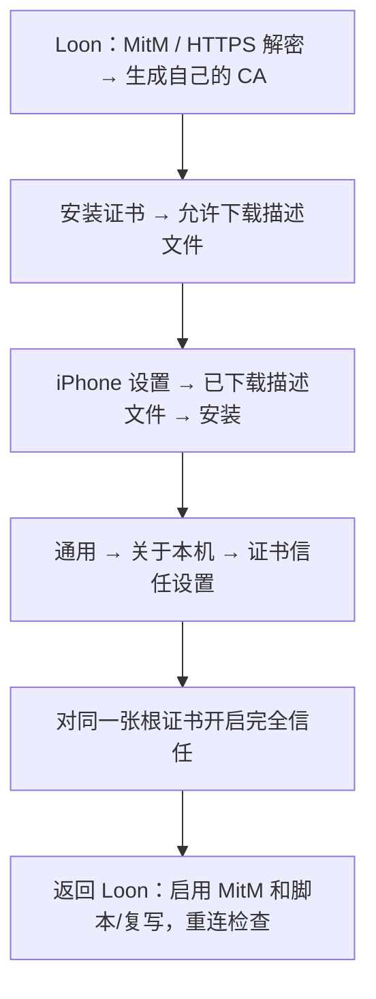
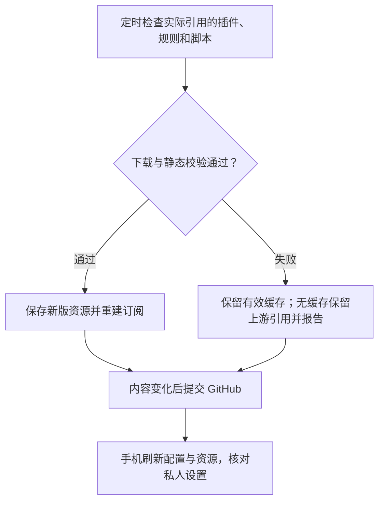

# Loon 自动分流、去广告与功能增强订阅

本项目面向中国大陆地区使用 Loon 的用户：国内服务、银行和支付优先直连，境外 App 使用独立代理策略。项目独立于小火箭的 shadowrocket-subscription 仓库。要求 **Loon 3.5.1（983）及以上**。配置保留自动测速选节点、各 App 独立策略、银行与支付直连和解密排除、271 个去重插件，以及 15 组会员响应脚本。原来的两个停用插件仍保持停用；其余 269 个插件及新增会员脚本启用。

## 1. 订阅地址

复制下面的完整地址，在 Loon 的配置管理中选择从 URL 下载/导入，下载后选为当前配置（入口名称可能随版本变化）：

```text
https://raw.githubusercontent.com/juscice/loon-subscription/main/dist/loon.conf
```

[打开配置订阅](https://raw.githubusercontent.com/juscice/loon-subscription/main/dist/loon.conf) · [查看自动更新记录](https://github.com/juscice/loon-subscription/actions/workflows/update.yml) · [查看资源同步报告](https://github.com/juscice/loon-subscription/blob/main/dist/update-report.json)

这是一份**配置订阅，不是机场节点订阅**。公开版本没有节点密码、私人机场链接、CA 证书及其密码。先备份自己的节点和证书，再切换配置；不要把私人配置提交到仓库。

## 2. 首次导入与节点选择

1. 在 Loon 中导入上面的配置 URL，选中它，更新远程资源。
2. 在订阅节点管理中加入自己的机场订阅，下载节点。不要把机场 URL 写入公开仓库。
3. 选择规则模式，授权 iOS 添加 VPN 配置并连接。
4. 查看策略组是否已有节点。香港、日本、美国等组按节点名称过滤；机场命名不带国家、地区或代码时，应调整本地过滤器或手动选择。
5. 「自动选择」按延迟测试结果切换；各地区「时延」组使用该地区的可用节点。测速延迟不等于下载带宽，也不保证流媒体或 AI 服务可以解锁。

| 场景 | 配置中的默认方向 | 可以如何调整 |
| --- | --- | --- |
| 银行、支付及国内服务 | DIRECT / 本地网络 | 保留银行直连与解密排除 |
| AI 服务 | 美国时延等境外策略 | 换成服务实际支持的地区节点 |
| YouTube、Spotify、社交、流媒体 | 各自独立策略组 | 在对应组中换地区或指定节点 |
| 未命中的请求 | FINAL 策略 | 按实际需要选择通用代理或直连 |

### LingJing 规则补充

参考 [LingJingMaster/Shadowrocket-Rules](https://github.com/LingJingMaster/Shadowrocket-Rules)，每轮自动更新读取其 8 个规则文件，转换为 Loon 本地规则并按匹配条件、策略去重；同策略的父域名已覆盖子域名时也去重。保留现有 ChatGPT、Claude、Gemini 独立策略，补充其他 AI、邮件、Apple 推送、香港银行与券商分流。补充规则在宽泛 Apple / Google 规则之前匹配，原有国内银行直连规则保留。

| 补充服务 | 默认策略 |
| --- | --- |
| 其他 AI / Apple AI 相关端点 | AI服务：美国时延 |
| 邮件传输端点 | 邮件服务：通用代理 |
| Apple 推送域名 | 苹果推送：通用代理 |
| 汇丰香港、其他香港银行 | 各自策略：DIRECT |
| 富途、长桥、老虎、雪盈、盈透等券商 | 券商服务：香港时延 |

GitLab、Atlassian、BiliBili 使用 blackmatrix7 的 Loon 规则文件，分别归入 GitHub 策略及 DIRECT。微信本地回调固定为 `127.0.0.1`；豆包、DeepSeek 和局域网反向解析域名优先直连。券商如需固定出口，可手动选择单节点；代理不能保证开户、交易或地域授权。

不直接导入 Shadowrocket 配置语法。上游银行 URL 路径规则未自动添加，避免扩大 HTTPS 解密范围；Apple 推送仅按域名分流，不将所有 TCP 5223 流量都归为推送。已有 HTTPDNS 插件保留，不叠加另一套拦截规则。DNS 与 MITM 沿用 Loon 当前设置。

DIRECT 使用设备当前网络直接连接；中国大陆用户使用时，国内服务通过本地网络访问。银行直连和绕过 TUN 能减少代理干扰，**不能隐藏 iOS 的 VPN 状态**；银行仍提示 VPN 时，暂时关闭 Loon 后重试。

## 3. HTTPS 解密：生成、安装、信任、开启

域名级拦截通常不需要解密；按 HTTPS 路径、正文或会员字段处理的插件，需要脚本/复写已启用并完成 MITM 设置。公开订阅不提供共享证书，请使用自己在设备上生成的 CA。



1. **生成：** 在 Loon 的 MitM / HTTPS 解密设置中生成 CA 证书；已有自己生成且有效的 CA 可以复用。
2. **安装：** 选择安装证书，允许下载描述文件。进入 iPhone「设置 → 已下载描述文件 → 安装」。若没有入口，到「设置 → 通用 → VPN 与设备管理」查看；必要时重新下载。
3. **信任：** 进入「设置 → 通用 → 关于本机 → 证书信任设置」，找到本次安装的根证书，打开完全信任开关并确认。安装描述文件不会自动完成 SSL/TLS 信任。
4. **开启：** 返回 Loon，确认选用同一张 CA，启用 MitM 和脚本/复写。保留已有主机名及银行排除项，不把解密范围改成全局 `*`。
5. **检查：** 重连 VPN，重新打开目标 App，查看请求是否命中相应域名和脚本，是否出现 TLS、脚本下载或执行错误。

此图是操作流程示意，菜单名称以安装版本为准。部分 App 有证书固定，系统信任 CA 后仍可能拒绝解密；这种情况下先关闭该 App 的相关插件/解密进行对照。

### 更新时保留个人设置

本公开文件没有 `ca-p12` 或 `ca-passphrase`。**第一次切换或更新后，检查自己的 CA、MitM 开关、机场订阅和策略选择仍在。** 如果当前版本支持独立的本地证书/个人设置，优先将它们保存在设备侧；如果设置保存在主配置文本中，请在更新前做仅存于自己设备的备份，并在更新后恢复私人字段。不要假设下载完整配置一定保留本地修改。

CA 的 `ca-p12` 含证书私钥，不能上传到 GitHub、Issue 或发给订阅使用者。不要把 Shadowrocket 的本地证书模块模板直接当作 Loon 配置使用。

## 4. 自动更新如何工作

GitHub Actions 每 6 小时检查一次，计划 UTC 00:37、06:37、12:37、18:37，北京时间 08:37、14:37、20:37、02:37；计划任务可能延迟。也可打开上方更新记录，选择 **Run workflow** 手动运行。



- 检查主配置引用的远程规则、插件及脚本；下载成功的插件继续检查其实际引用的脚本与规则。重复 URL 仅处理一次。
- JavaScript 只做语法检查，不执行上游代码。空文件、HTML 错误页面、错误规则格式或脚本语法不通过时，不覆盖有效缓存。
- 成功资源改为本仓库 Raw 地址；插件原文与改写后的可订阅插件分开存放。尚无缓存的资源保留原始链接，报告为 `unavailable`，不把它当作已同步成功。
- `profiles/loon.conf` 是维护模板；`dist/loon.conf` 是生成结果。更新器读取 [PluginHub](https://hub.kelee.one/) 的公开目录，只自动加入“去广告”和“功能增强”分类的 Loon 插件，按原始 URL 去重；已有插件的启停设置保持不变，新增项启用。不会自动加入签到、节点检测等其他类别。App 接口路径和国家策略仍需维护模板。
- 目录下载失败时保留最近有效的目录缓存。报告的 `catalog` 字段区分目录同步状态、筛选数量、新增数量和已存在数量。目录能下载不代表目录中的插件原文也能下载。
- 资源解析器和 GeoIP/ASN 数据库仍由 Loon 按原始地址下载，不纳入本次文本缓存。

### 手机端自动更新插件

仓库更新配置与插件清单，手机 Loon 下载和更新配置中引用的插件。未镜像的插件已保留作者原始链接；手机能正常访问这些链接时，可以直接更新插件，无需等待 GitHub 镜像成功。

1. 在 Loon 中打开「更多 → 资源自动更新策略」，以当前版本的实际入口名称为准。
2. 为插件和需要的远程资源开启自动更新，建议更新间隔为 **24 小时**；同时检查配置订阅的自动更新设置，以获取新增插件清单。
3. 首次设置后手动更新全部资源，核对插件是否下载成功；需要立即生效时刷新配置和资源，再重连检查。
4. 更新配置后核对自己的机场节点、CA、MitM 开关和策略选择仍在。

自动更新策略需要在手机端设置，导入本项目配置不代表已经开启。iOS 后台调度不保证严格按时更新。[Loon 官方更新说明](https://t.me/s/LoonNews?before=475)提到在「更多 → 资源自动更新策略」手动设置；也可使用官方支持的[更新所有订阅资源链接](https://www.nsloon.com/openloon/update?sub=all)手动触发，见 [URL Scheme 文档](https://nsloon.app/docs/Scheme/)。

**同步报告中的 `unavailable` 或 `degraded` 描述 GitHub 构建端的下载、镜像状态，不等于手机插件不可用。** 如果手机已成功下载，可继续使用和自动更新；如果手机也下载失败，再查看 Loon 的资源下载日志。

## 5. 功能边界与排查

会员脚本已启用，但启用不代表当前 App 版本实际有效，也不代表账户在服务端获得真实订阅、云服务额度或付费内容授权。微信读书上游明确标注兼容 **6.0.1 / 5.4.3**；新版效果未确认。RevenueCat 是一个按 User-Agent 分派的合集，匹配表不是实测可用名单。Spotify 保留原有插件，未叠加另一套 Protobuf 处理。

| 问题 | 处理顺序 |
| --- | --- |
| 没有节点、境外 App 无法连接 | 添加机场订阅；检查国家过滤器和策略组实际候选 |
| 广告或脚本无效果 | 检查资源下载、插件启用、脚本/复写开关、CA 安装与完全信任、MitM 和匹配日志 |
| 资源出现 403、404 或超时 | 看同步报告；可继续用有效缓存，无缓存时检查上游可达性 |
| TLS / 证书不受信任 | 核对 Loon 使用的 CA 与 iOS 信任的 CA 一致、未过期 |
| 银行仍然检测 VPN | 暂时关闭 Loon；直连规则不能消除系统 VPN 标志 |
| 某 App 更新后异常 | 暂停其相关插件/脚本，再检查上游兼容说明与接口变化 |
| 更新后 CA 或节点丢失 | 恢复设备内备份；勿把私人字段加入公开模板 |

保留全部去广告插件意味着其中可能仍有功能重叠（例如 VVebo 修复与微博广告处理）；出现特定 App 异常时，在设备内停用冲突项。项目通过构建和静态检查，未对所有 App 作 iPhone 实测。

## 6. 维护与验证

```sh
python3 tools/test_update.py
python3 tools/update.py --offline
python3 tools/update.py
```

小火箭与 Loon 分属两个仓库，各自独立运行更新任务。GitHub Actions 长期不运行时，检查仓库 Actions 是否启用、令牌写入权限及计划任务是否被停用。

参考：[Loon MITM 文档](https://nsloon.app/docs/MitM/) · [Loon 脚本文档](https://nsloon.app/docs/Script/script_v2/) · [Loon 通用配置](https://nsloon.app/docs/General/) · [Apple 根证书完全信任](https://support.apple.com/zh-cn/102390)。

说明核对日期：2026-10-06。原作者和上游来源保留在配置与插件中。

### LingJing 补充规则许可

以下许可适用于从 LingJingMaster/Shadowrocket-Rules 引入的补充规则，其他上游资源仍遵循各自许可。

```text
MIT License

Copyright (c) 2026 Ling_Jing

Permission is hereby granted, free of charge, to any person obtaining a copy
of this software and associated documentation files (the "Software"), to deal
in the Software without restriction, including without limitation the rights
to use, copy, modify, merge, publish, distribute, sublicense, and/or sell
copies of the Software, and to permit persons to whom the Software is
furnished to do so, subject to the following conditions:

The above copyright notice and this permission notice shall be included in all
copies or substantial portions of the Software.

THE SOFTWARE IS PROVIDED "AS IS", WITHOUT WARRANTY OF ANY KIND, EXPRESS OR
IMPLIED, INCLUDING BUT NOT LIMITED TO THE WARRANTIES OF MERCHANTABILITY,
FITNESS FOR A PARTICULAR PURPOSE AND NONINFRINGEMENT. IN NO EVENT SHALL THE
AUTHORS OR COPYRIGHT HOLDERS BE LIABLE FOR ANY CLAIM, DAMAGES OR OTHER
LIABILITY, WHETHER IN AN ACTION OF CONTRACT, TORT OR OTHERWISE, ARISING FROM,
OUT OF OR IN CONNECTION WITH THE SOFTWARE OR THE USE OR OTHER DEALINGS IN THE
SOFTWARE.
```

## 7. 本次插件同步故障诊断（2026-10-05）

已核实 kelee.one 的 403 响应正文是 Cloudflare 的 `Sorry, you have been blocked` 页面，未返回插件原文。这是当前自动更新访问被上游拦截，不能据此断言插件已删除或网站对所有人都不可用。

更新器已修正：每轮先检查受保护站点；确认访问拦截后停止该站点批量下载，保留有效缓存；没有缓存时保留原链接，并将构建明确标记为 `degraded`。Actions 的 Success 仅表示任务完成，应同时看 Summary 的镜像插件数与同步报告。

目前 271 个插件中，1 个可形成本站镜像，270 个可莉插件尚未取得有效原文。当前配置仍保留这些原链接，不能称为全部插件已经镜像化。完整解决需上游提供允许自动下载的公开文件或独立官方备用来源，或者由使用者提供在 Loon 正常下载的插件及依赖文件供校验缓存。不能用 Surge 模块直接替换 Loon 插件，也不会改用不明代理、模拟挑战令牌或取消下载校验。

已接入 PluginHub 目录自动更新。接入时目录共 275 项，其中 263 项属于去广告或功能增强，现有配置已全部包含，新增为 0。目录的插件下载地址全部仍指向 `kelee.one`，所以接入目录不会消除原文下载拦截。无需更换配置订阅地址；手机刷新订阅后可获得生成配置，插件的实际下载与执行效果仍以 Loon 日志为准。

## 知乎去广告与连接排查（2026-10-06）

知乎去广告插件 `Zhihu_remove_ads.lpx` 保持启用。知乎主域 `zhihu.com` 和图片域 `zhimg.com` 优先直连并使用真实 IP，未加入 MitM 排除，以保留插件的 HTTPS 脚本处理能力。需要在手机上更新插件及其依赖，完成自己的 CA 安装和完全信任，并开启 MitM 与脚本。

此前临时停用插件、排除知乎解密的方案已撤销，因为这会停止知乎去广告。当前没有知乎设备错误日志，也没有取得该插件原文，无法确认网络连接错误的触发原因或保证当前 App 版本兼容。

更新配置与远程资源后，确认知乎插件启用，彻底退出知乎、重连 Loon 后测试。若仍提示网络错误，请导出手机已下载的知乎插件及依赖脚本，并提供 `api.zhihu.com` 请求详情、TLS 或脚本错误日志、知乎和 Loon 版本（日志中请隐去 Cookie、Authorization、账号与设备标识）。这些信息用于针对具体接口修复，不将停用整个插件作为最终方案。
